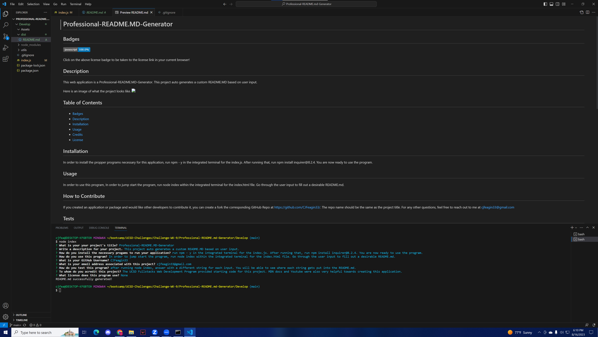

# Professional-README.md-Generator

## Badges

Click on the above license badge to be taken to the license link in your current browser!

## Description

This web application is a Professional-README.md-Generator. This project auto generates a custom README.md based on user input.

Here is an image of what the project looks like. 

## Table of Contents

  - [Badges](#badges)
  - [Description](#description)
  - [Installation](#installation)
  - [Usage](#usage)
  - [Credits](#credits)
  - [License](#license)

## Installation

In order to install the propper programs necessary for this application, run npm - y within the integrated terminal first for the index.js. After running that, run npm install inquirer@8.2.4. You are now ready to use the program!

## Usage

In order to use this program, In order to use the program, run node index within the integrated terminal for the index.html file. Go through the user input to fill out a desirable README.md.

## How to Contribute

If you created an application or package and would like other developers to contribute it, you can create a fork the corresponding GitHub Repo at https://github.com/CJFeagin33@gmail.com/. The repo name should be the same as the project title. For any other questions, feel free to reach out to me at cjfeagin33@gmail.com

## Tests

In order to test this program, after running node index, fill out each input with a unique string. You will be able to see where each input is plugged into the README.md.

## Credits

The UCSD Fullstacks Web Developement Program provided starting code for this project. 

## License

None is this project's license. For more information about licenses, please visit https://docs.github.com/en/repositories/managing-your-repositorys-settings-and-features/customizing-your-repository/licensing-a-repository